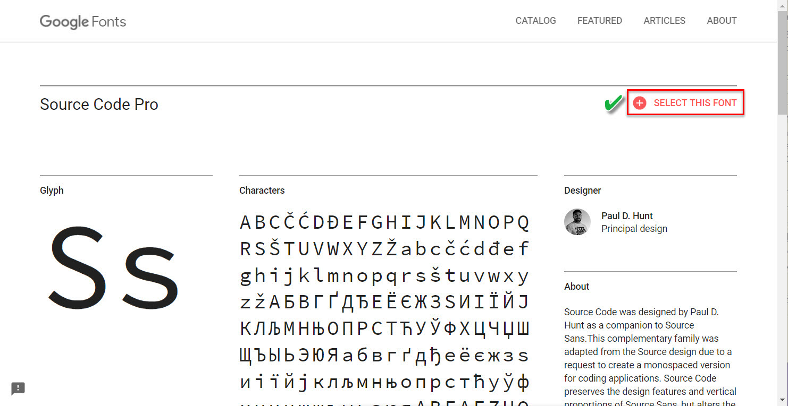
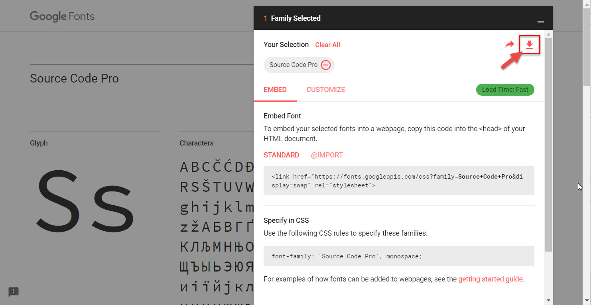
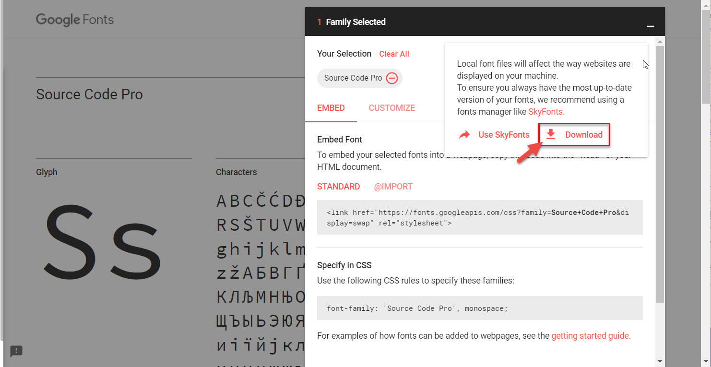

# uPyCraft IDE (for Windows PC)

## Python 설치
> 권장 설치: Anaconda

1. [Python 3.7.x ↑ 다운로드 및 설치](https://www.python.org/downloads/): https://www.python.org/downloads/
   * 설치시 'Add Python 3.x to PATH' 체크 필요함

2. [Anaconda Distribution 다운로드 및 설치](https://www.anaconda.com/distribution/): https://www.anaconda.com/distribution/
   * Python 3.7 Version 다운로드

## uPyCraft IDE 설치

1. [uPyCraft IDE 다운로드 및 설치](https://github.com/DFRobot/uPyCraft/blob/master/uPyCraft.exe): https://github.com/DFRobot/uPyCraft/blob/master/uPyCraft.exe
   1. 'C:\MicroPython' 폴더 생성
   2. 다운로드한 <b>uPyCraft.exe</b>를 'C:\MicroPython' 폴더로 이동
   3. 'C:\MicroPython\uPyCraft.exe' 실행

2. <i><b>Please install SourceCodePro font</b></i> 팝업창이 뜨는 경우
   1. <i><b>uPyCraft</b></i> 종료

   2. 'Google Fonts Source Code Pro'로 Google 검색

   3. 'Source Code Pro - Google Fonts' 항목 선택

   4. 우상단의 'SELECT THIS FONT' 선택
      

   5. 우하단의 'Family Selected' 바 선택
      

   6. 우상단의 다운로드 아이콘(↓) 클릭
      

   7. 압축 파일중 'SourceCodePro-Regular.ttf'를 'C:\MicroPython' 폴더에 복사해 넣은 후 'SourceCodePro.ttf'로 파일명 변경하기

   8. 'C:\MicroPython\SourceCodePro.ttf'에서 우마우스 클릭하여 '<i><b>모든 사용자용으로 설치</b></i>' 클릭
      * '모든 사용자용으로 설치'가 없는 경우 '설치'로 폰트 설치

   9. 'C:\MicroPython\uPyCraft.exe' 실행
