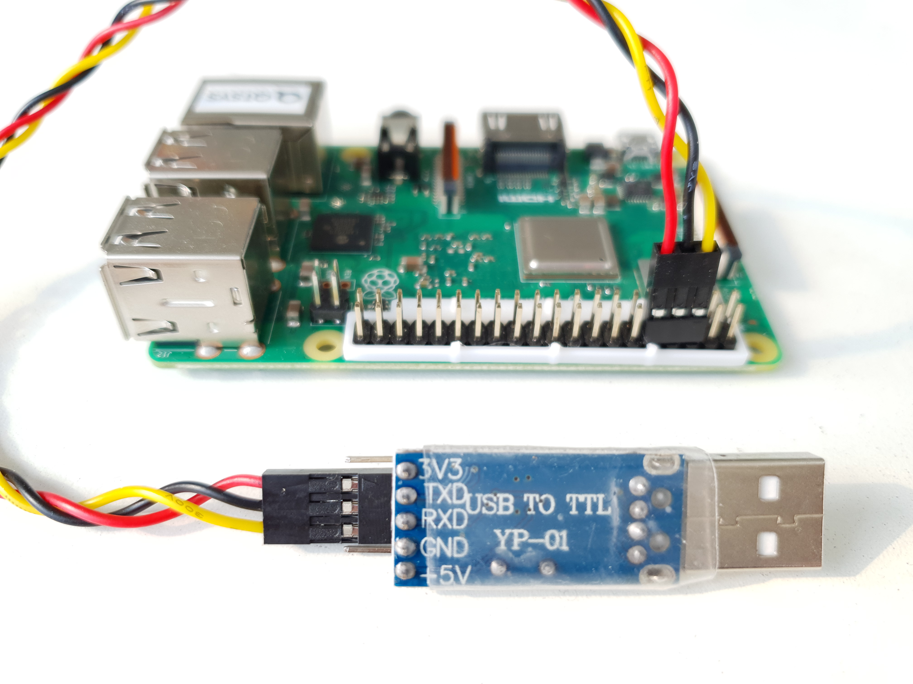

# MicroSD 사전 설정
> 디스플레이를 연결할 수 없을 때의 작업

## USB Serial을 이용할 경우

1. USB Serial 드라이버 설치 (PC, Mac용)
   > 테스트를 진행한 USB Serial 디바이스는 <i><b>PL2303HX</b></i>이며, 다른 USB Serial 디바이스는 그에 맞는 드라이버를 다운로드 받아서 별도 설치해야 한다.

   1.1. Windows 10용 USB Serial 드라이버
      1. USB Serial Device를 Windows USB 포트에 삽입
      2. '시작'(윈도 심볼)을 우마우스 클릭 &gt; '장치 관리자' 선택
         1. '포트(COM && LPT)' 클릭하여 확장
	      2. COM Por 확인
            * 'PL2303HXA PHASED OUT SINCE 2012. PLEASE CONTACT YOUR SUPPLIER.' 나올시 우마우스 클릭하여 '디바이스 제거' 선택
	           1. '이 장치의 드라이버 소프트웨어를 삭제합니다.' 선택
              2. '제거' 버튼 클릭
		        3. 단계 2.로 가서 드라이버 프로그램 설치
	           * 포트명 앞에 경고 아이콘이 있을 경우 드라이버 재설치 필요하며 단계 2.로 갈 것.

   2. USB Serial 드라이버 이상이 있을 경우 드라이버 다운로드후 재설치
      1. USB Serial Device를 USB 포트에서 제거
      2. https://kitschool.tistory.com/130 에서 드라이버 다운로드 및 드라이버 프로그램 설치
      3. 단계 1.로 이동

   1. 메모장 등의 편집기를 이용하여 MicroSD의 boot 에 있는 <i><b>config.txt</b></i> 파일을 연다.
   2. 아래 내용이 없는 경우 추가하여 저장한다.
      <pre><code>enable_uart=1</code></pre>
   3. MicroSD를 라즈베리파이에 삽입한다.
   4. USB Serial 디바이스의 핀을 라즈베리파이의 핀에 연결한다.
      > *주의*) 작업시 전원은 반드시 Off로!

      | USB Serial | RasPi Pin No |
      |:----------:|:------------:|
      | GND        | 6 (GND)      |
      | Rx         | 8 (Tx)       |
      | Tx         | 10 (Rx)      |
      
   5. USB Serial 디바이스를 PC의 USB 포트에 연결한다.
   4. 라즈베리파이 전원을 연결하여 부팅한다.

## Hotspot을 이용하는 경우
   1. WiFi 접속을 위한 <i><b>wpa_supplicant.conf</b></i> 파일을 MicroSD의 boot에 복사해 넣기
   2. 접속할 WiFi AP의 <i><b>ssid</b></i>와 <i><b>비밀번호</b></i>를 입력하고 저장한다.
      <pre><code>country=GB
      ctrl_interface=DIR=/var/run/wpa_supplicant GROUP=netdev
      update_config=1

      network={
         ssid="&lt;ssid-name&gt;"
         psk="&lt;password&gt;"
      }</code></pre>
   3. MicroSD를 라즈베리파이에 삽입후 전원을 연결하여 부팅한다.

# Raspberry Pi의 IP 주소
  <pre><code> $ ifconfig</code></pre>
  <pre><code>eth0: flags=4099<UP,BROADCAST,MULTICAST>  mtu 1500
        ether b8:27:eb:0a:0d:86  txqueuelen 1000  (Ethernet)
        RX packets 0  bytes 0 (0.0 B)
        RX errors 0  dropped 0  overruns 0  frame 0
        TX packets 0  bytes 0 (0.0 B)
        TX errors 0  dropped 0 overruns 0  carrier 0  collisions 0

  lo: flags=73<UP,LOOPBACK,RUNNING>  mtu 65536
        inet 127.0.0.1  netmask 255.0.0.0
        inet6 ::1  prefixlen 128  scopeid 0x10<host>
        loop  txqueuelen 1000  (Local Loopback)
        RX packets 0  bytes 0 (0.0 B)
        RX errors 0  dropped 0  overruns 0  frame 0
        TX packets 0  bytes 0 (0.0 B)
        TX errors 0  dropped 0 overruns 0  carrier 0  collisions 0

  <b><i><u>wlan0</u></i></b>: flags=4163<UP,BROADCAST,RUNNING,MULTICAST>  mtu 1500
        inet <b><i><u>192.168.100.80</u></i></b>  netmask 255.255.255.0  broadcast 192.168.100.255
        inet6 fe80::a1c:e5d6:efac:b041  prefixlen 64  scopeid 0x20<link>
        ether b8:27:eb:5f:58:d3  txqueuelen 1000  (Ethernet)
        RX packets 15  bytes 1648 (1.6 KiB)
        RX errors 0  dropped 0  overruns 0  frame 0
        TX packets 37  bytes 5409 (5.2 KiB)
        TX errors 0  dropped 0 overruns 0  carrier 0  collisions 0</code></pre>

# Raspbian Update and Upgrade
  * Upgrade시 소요시간이 제법 길기 때문에 교육시에는 실행하지 말 것
    <pre><code>$ sudo apt-get update
    $ sudo apt-get upgrade
    $ sudo rpi-update -y</code></pre>

# 라즈베리파이 한글 폰트 설치
  1. 라즈베리파이에서 한글 보기용 폰트 설치
     <pre><code>$ sudo apt-get install fonts-unfonts-core fonts-nanum fonts-nanum-extra</code></pre>

# 라즈베리파이 원격접속 설정
  > Windows 원격데스크톱용
  1. 기존 VNC Server 제거
     <pre><code>$ sudo apt-get purge -y realvnc-vnc-server</code></pre>
  2. 새 VNC Server 설치
     <pre><code>$ sudo apt-get install -y tightvncserver</code></pre>
  3. XRDP 설치
     <pre><code>$ sudo apt-get install -y xrdp</code></pre>
  4. Windows 원격데스크톱으로 라즈베리파이에 연결
