# PC용 MariaDB 설치

## MariaDB 설치
1. 다운로드: https://mariadb.com/

2. 우측의 '다운로드' 버튼 클릭
   

3. 'MariaDB Platform' &gt; 'MariaDB Community Server'에서 'OS'를 'MS Windows (64-bit)' 또는 'MS Windows (32-bit)'를 선택
   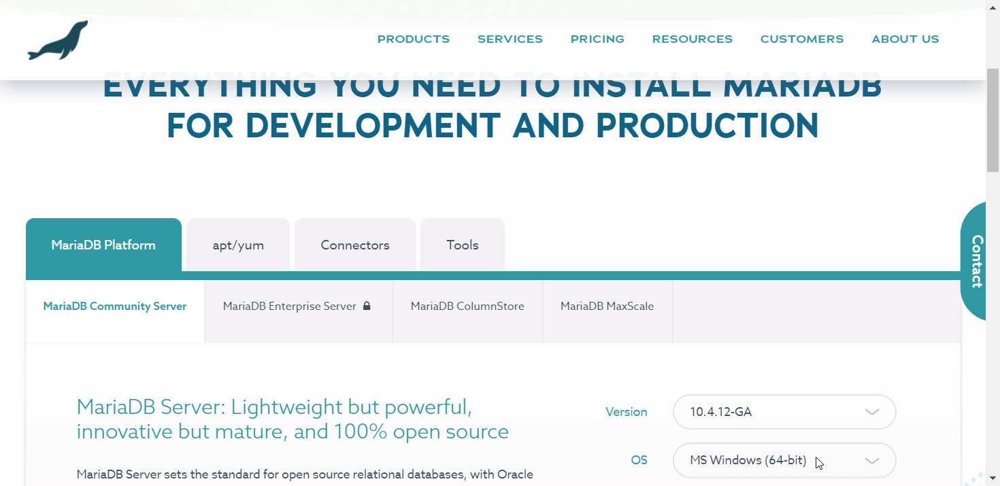

4. 아래의 'Download' 버튼 클릭
   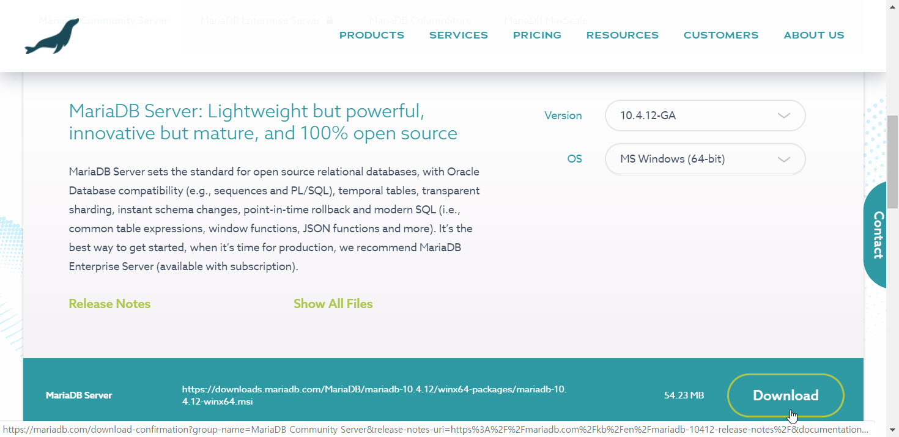

5. MariaDB 설치
   1. 설치 첫 화면
      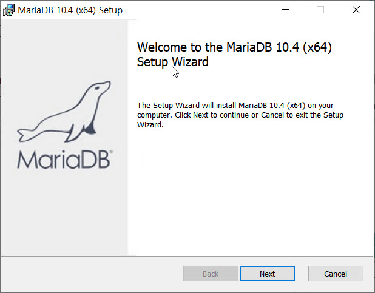

   2. 라이센스 동의
      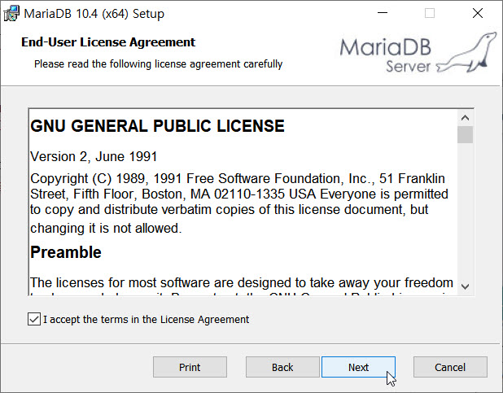

   3. 사용자 설정
      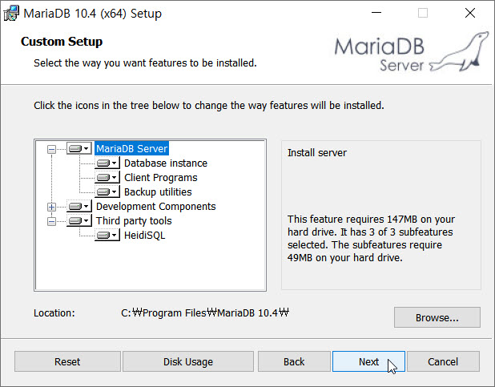

   4. 'root' 암호 (예시에는 'P@ssw0rd')
      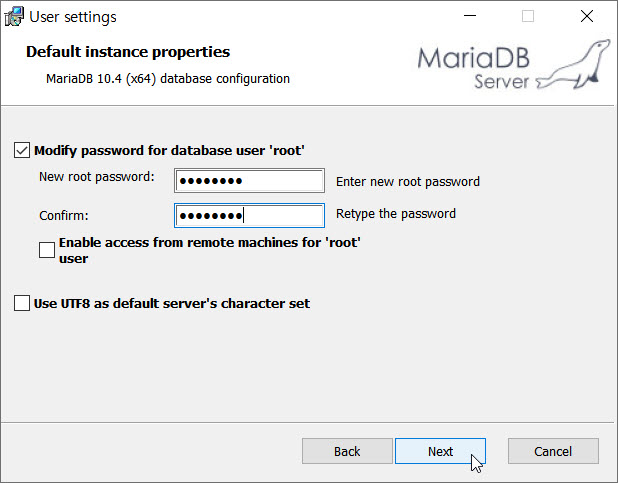

   5. 서비스 정의
      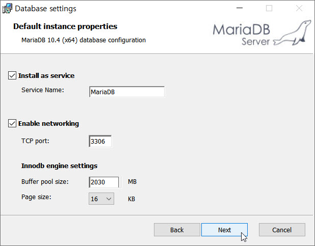

   6. 사용정보 전송 여부 선택
      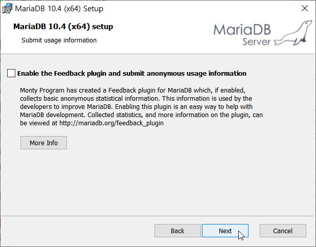
      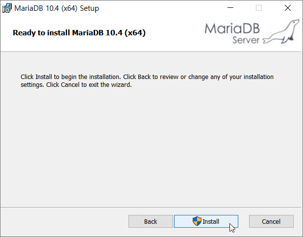
      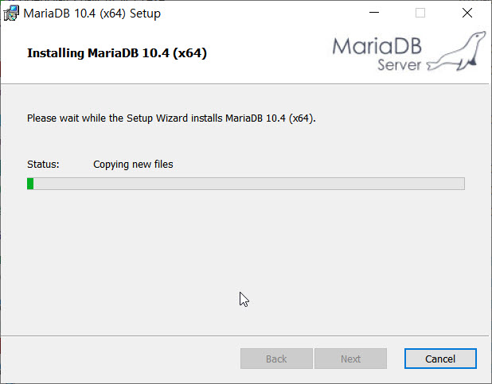
      
   7. 설치 완료
      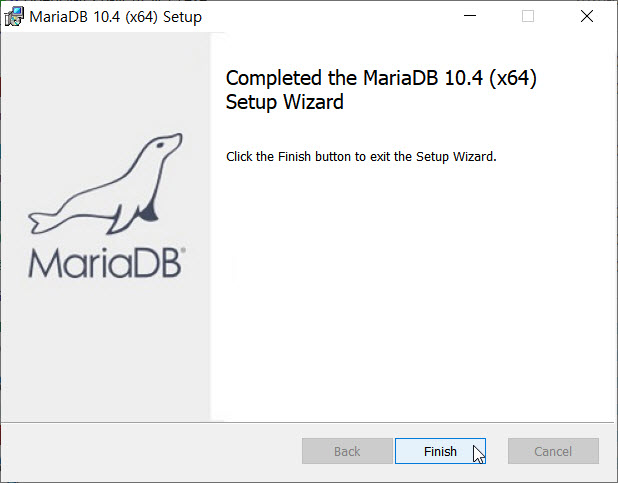

## MariaDB 실행
* [메뉴] > [MariaDB 10.4 (x64)] > 'MySQL Client (MariaDB 10.4 (x64))'를 선택하여 실행
