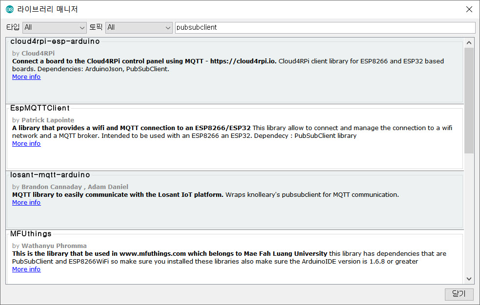
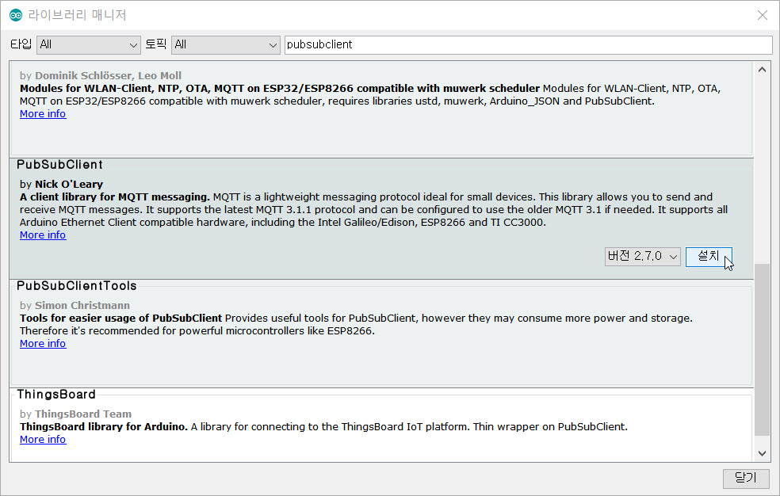
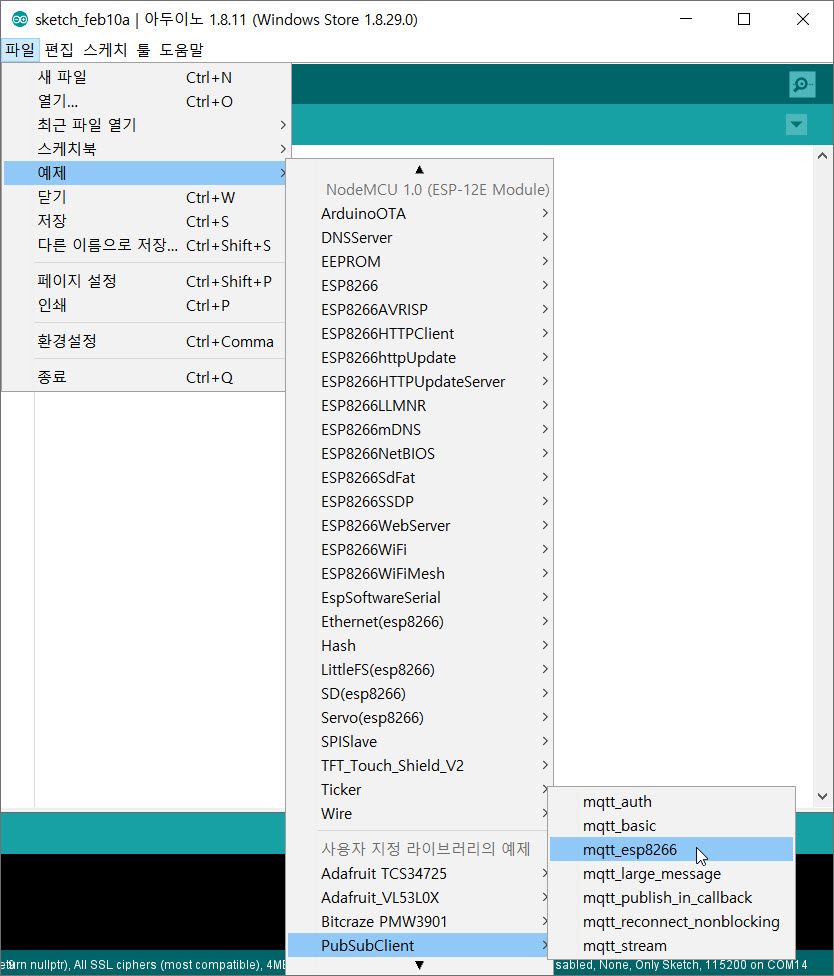
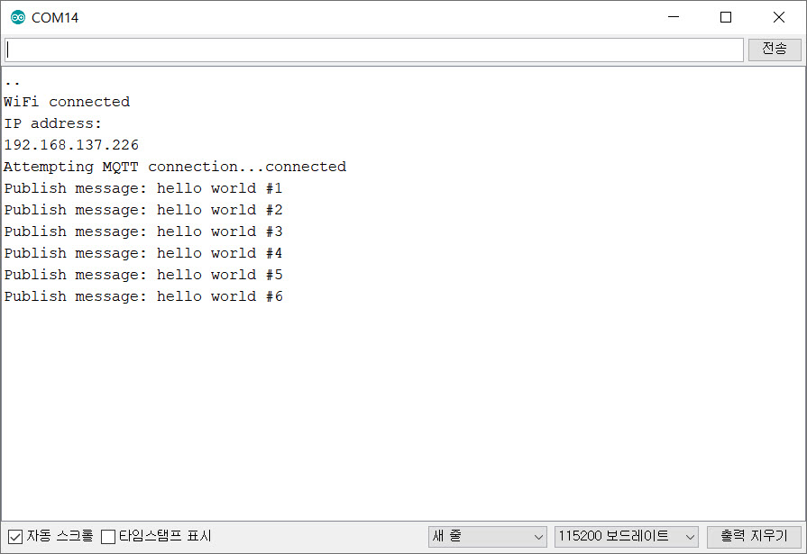
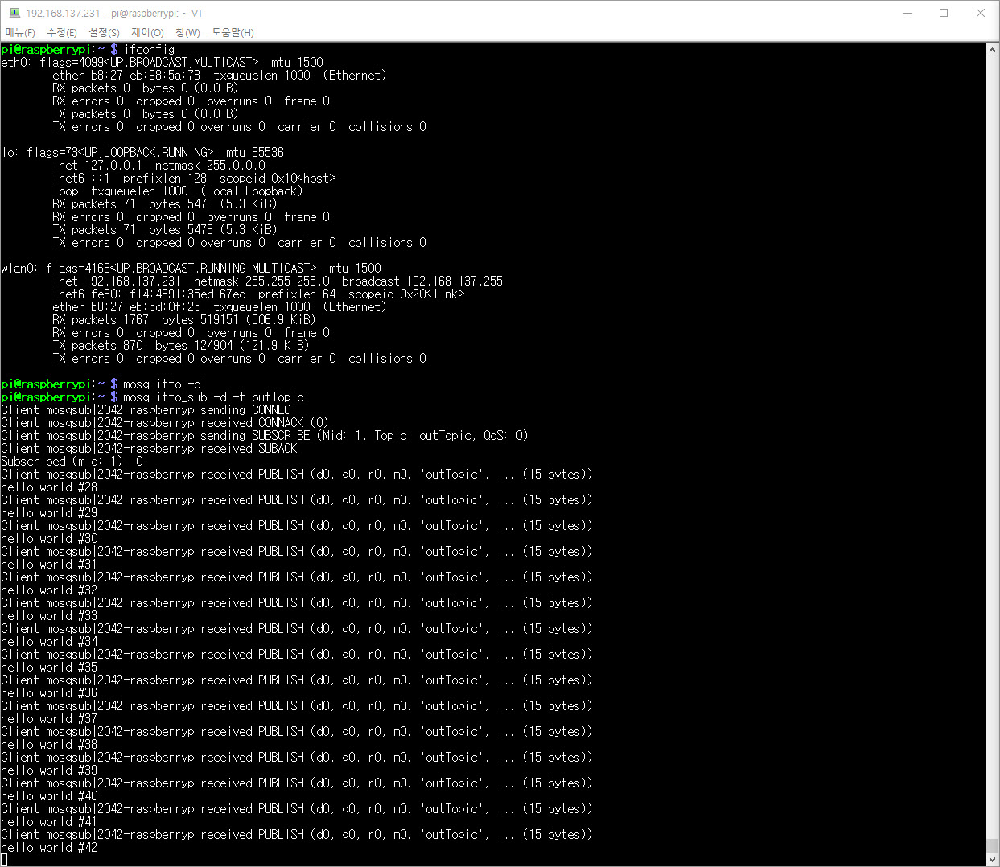
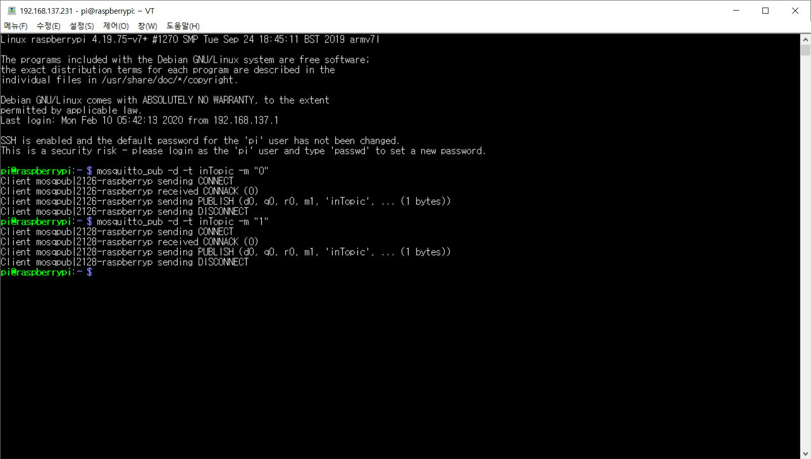

# NodeMCU로 MQTT 테스트

## NodeMCU 라이브러리 설치
1. Arduino IDE 실행
2. [메뉴] > [스케치] > [라이브러리 포함하기] > [라이브러리 관리] 선택
3. '라이브러리 매니저'에서 pubsubclient'로 검색
   
4. 'PubSubClient'에서 '설치' 버튼을 클릭하여 설치
   

## NodeMCU 예제 소스 작성
1. [메뉴] > [파일] > [예제] > [PubSubClient] > [mqtt_esp8266] 선택
   
2. 소스에서 아래 부분을 찾아 해당 부분을 수정한다. (31-33줄)
   <pre><code>const char* ssid = "........";
   const char* password = "........";
   const char* mqtt_server = "broker.mqtt-dashboard.com";</code></pre>
   * ssid: AP의 SSID명
   * password: SSID의 암호
   * mqtt_server: 라즈베리파이의 IP 주소
3. 소스의 'publish'와 'subscribe'를 확인한다. (95, 97줄)
   <pre><code>94:      // Once connected, publish an announcement...
   95:      client.publish("outTopic", "hello world");
   96:      // ... and resubscribe
   97:      client.subscribe("inTopic");
   </code></pre>

4. 소스의 'callback()' 함수를 확인한다.
   <pre><code>64:void callback(char* topic, byte* payload, unsigned int length) {
   65:  Serial.print("Message arrived [");
   66:  Serial.print(topic);
   67:  Serial.print("] ");
   68:  for (int i = 0; i < length; i++) {
   69:    Serial.print((char)payload[i]);
   70:  }
   71:  Serial.println();
   72:
   73:  // Switch on the LED if an 1 was received as first character
   74:  if ((char)payload[0] == '1') {
   75:    digitalWrite(BUILTIN_LED, LOW);   // Turn the LED on (Note that LOW is the voltage level
   76:    // but actually the LED is on; this is because
   77:    // it is active low on the ESP-01)
   78:  } else {
   79:    digitalWrite(BUILTIN_LED, HIGH);  // Turn the LED off by making the voltage HIGH
   80:  }
   81:
   82:}</code></pre>

5. 컴파일 및 업로드를 진행한다.
6. 시리얼 모니터를 열어서 메시지 전송을 확인한다.
   

## 라즈베리파이 구독 및 배포 테스트
1. 구독용 터미널을 연다.
   * 'outTopic'으로 구독한다.
      <pre><code>$ mosquitto -d
      $ mosquitto_sub -d -t outTopic</code></pre>
      

2. 배포용 터미널을 연다.
   * 'inTopic'으로 NodeMCU의 LED를 켜고 끈다.
     * NodeMCU LED 끄기
       <pre><code>$ mosquitto_pub -d -t inTopic -m "0"</code></pre>
     * NodeMCU LED 켜기
       <pre><code>$ mosquitto_pub -d -t inTopic -m "1"</code></pre>
      
