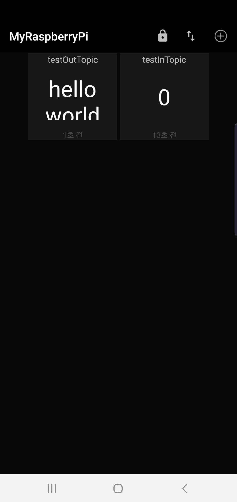

# 휴대폰으로 MQTT 테스트

## 구글 앱 설치
1. 'MQTT Dash' 앱 검색하여 설치
   * MQTT Dash (IoT, Smart Home)

## 앱 실행

1. MQTT 디바이스 정의
   1. 우측 상단의 + 아이콘 터치하여 아래와 같이 입력한다.
     * Name: MyRaspberryPi
     * Address: &lt;MQTT가 작동중인 라즈베리파이 IP 주소&gt;
     * Port: 1833
   2. 우측 상단의 저장 아이콘 터치
   3. 'MyRaspberryPi' 터치

2. 'outTopic' 정의
   1. 우측 상단의 + 아이콘 터치
   2. 'Choose type'(토픽 타입)에서 'Text' 선택하여 아래와 같이 입력한다.
      > 메시지 구독 및 배포용
      * Name: testOutTopic
      * Topic (sub): outTopic
   3. 우측 상단의 저장 아이콘 터치

3. 'inTopic' 정의
   1. 우측 상단의 + 아이콘 터치
   2. 'Choose type'(토픽 타입)에서 'Text' 선택하여 아래와 같이 입력한다.
      > NodeMCU LED On/Off 배포 및 구독용
      * Name: testOutTopic
      * Topic (sub): outTopic
   3. 우측 상단의 저장 아이콘 터치

4. 구독/배포 테스트
   1. 'testOutTopic'에 'Phone'을 입력한 후에 메시지 결과를 본다.
   2. 'testInTopic'에 '0' 또는 '1'을 입력한 후에 NodeMCU의 LED 상태를 살펴본다.
   
